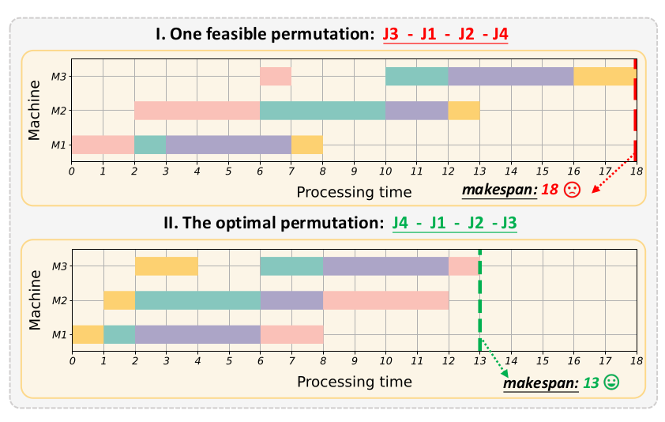

# flowshop_permutation_problem

# Graph-Based Imitation Learning for Permutation Flow Shop Scheduling (PFSS)

## 📌 Project Overview

This is an implementation of the paper **Learning to Optimize Permutation Flow Shop Scheduling via Graph-based Imitation Learning** (check it via this link https://arxiv.org/abs/2210.17178 ) presents a novel approach to solving the 
Permutation Flow Shop Scheduling (PFSS) problem, a complex optimization challenge commonly found in manufacturing and production systems.
The model learns from **expert solutions (NEH heuristic)** and uses a **Graph Neural Network (GNN) with attention mechanisms**  
to predict optimal job sequences that minimize the **makespan**.

## 🚀 Features
- Implements **Graph-Based Imitation Learning (IL)** using **Gated Graph Convolutional Networks (GGCN)**.
- Learns scheduling from **expert solutions (NEH heuristic)**.
- Trains using **supervised learning** and optimizes using **CrossEntropyLoss**.
- Supports **variable job and machine configurations**.
- Provides **evaluation results** with predicted sequences and makespan.
